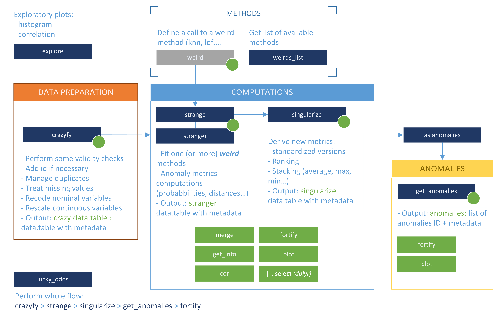

---
output:
  md_document:
    variant: markdown_github
---

```{r, echo = FALSE}
knitr::opts_chunk$set(
  collapse = TRUE,
  comment = "#>",
  fig.path = "man/figures"
)
suppressMessages(library(stranger))
```

## stranger package

`stranger` is a framework for unsupervised anomalies detection that simplifies the user experience because the one does not need to be concerned with the many packages and functions that are required. It acts as a wrapper around existing packages (_"a la Caret"_) and provides in a clean and uniform toolkit for evaluation  explaination reporting routines. Hence the name `stranger` taht stands for "Simple Toolkit in R for Anomalies Get Explain and Report".

`stranger` provides wrapper around several packages that contain anomaly detection routines. One approach is called a `weird`. Currently implemented methods (_weirds_) can be obtained by using `weird_list` function. Underlying methods deal with: `r paste(unlist(weirds_list()$detail[,1]),collapse=", ")`.

Obviously, to be able to exploit `stranger`, user will need to have various packages installed -- those ones containing computational routines.


```{r echo=FALSE, eval=TRUE}
w=weirds_list()$detail
knitr::kable(w[,c(1:4,6,9)],row.names = FALSE)
```

## stranger basics

Using `stranger`, user has at disposal an analysis workflow.

<hr/>

<hr/>


Main functions associated with proposed analysis workflow deal with:

* Data preparation with [`crazyfy`](./reference/crazyfy.html): treating missing values, factors/charaters variables (methods usually require numeric values), deduplicate data (but keeping a matching table to restore all records), scaling (important!)...
* Metrics computations (using _weirds_) is performed by [`strange`](./reference/strange.html) (using one _weird_) or [`stranger`](./reference/strange.html) (using many _weirds_ at once). 
* Once some metrics are available, one has to make them comparables (standardize) and eventually to aggregate them (stack). This is the purpose of [`singularize`](./reference/singularize.html).
* Based on all that is then available, once can derive anomalies (flags), which is done with [`get_anomalies`](./reference/get_anomalies.html)
* Merging back any object with source data (or any other data assumed there is an id) is possible with dedicated [`fortify`](./reference/fortify.html) methods.

In addition, those steps lead to objects having a specific S3 class and some visualization is possible thanks to dedicated [`plot`](./reference/plot.html) methods.

## Guide to use `stranger` package

We did write some vignette to accompany you in the discovery of anomalies using `stranger`. We recommend to read vignettes in the following order:

* __stranger for the impatient__ ([vignette](./articles/stranger_for_the_impatient.html)) will introduce you to quick workflows to get and visualize some anomalies.
* __Working with weirds__ ([<TBD>](./articles/working_with_weirds.html)) introduce the usage of `stranger` function, the possibility to [`merge`](./reference/merge.html),  stack (aggregate) methods and normalize metics with [`singularize`](./references/singularize.html) and also derive your own anomalies based on manual filtering. 
* __Stranger weirds methods__ ([vignette](./articles/stranger_weirds_methods.html)) list all available _weirds_ with some information on them.
* __Extending stranger__ ([<TBD later>](./articles/tbd.html)) is only suitable if you want to add some _weirdness_. In the case you want an additional _weird_ method you can read this guide or contact us!.


## Installation

`stranger` is not currently available on CRAN. Install it from github:

```{r, eval=FALSE}
# install.packages(devtools)
devtools::install_github("welovedatascience/stranger")
```


## TODO

* Vignettes
  + sample analyis (Sven)
  + Extending stranger (Eric)
* Shiny small interface for anomalies exploration 
* Add weird for H2O autoencode
* add install_weirdness to install all weird packages
* add `get_info` methods for every class

